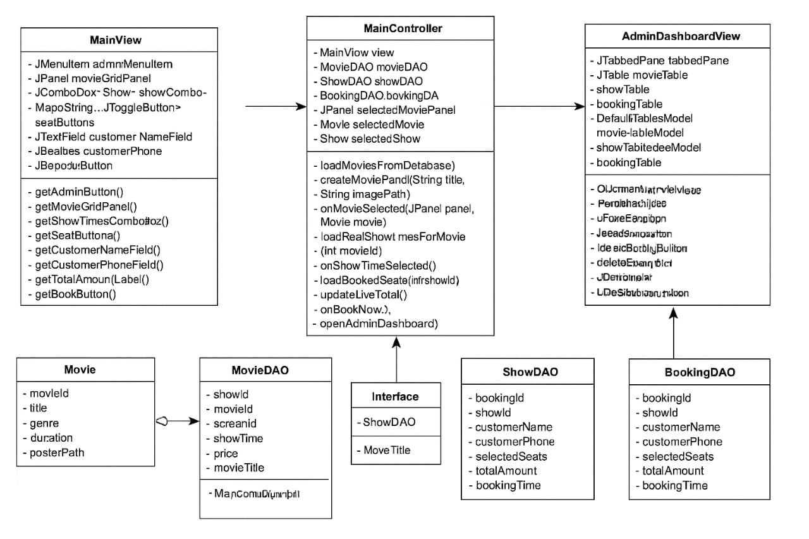

# 🎬 Movie Ticket Booking System

A Java-based desktop application for browsing movies, selecting seats, booking tickets, and managing bookings.
Developed as part of a college project.

## 🧰 Tech Stack

* **Language:** Java
* **GUI Framework:** Java Swing
* **Database:** MySQL
* **Database Connectivity:** JDBC
* **Architecture:** MVC (Model–View–Controller)
* **IDE:** Eclipse

## ⚙️ Prerequisites

* **Java Development Kit (JDK) 8 or higher:** [Download Java](https://www.oracle.com/java/technologies/javase-downloads.html)
* **MySQL Server:** [Download MySQL Community Server](https://dev.mysql.com/downloads/mysql/)
* **XAMPP / WAMP / MAMP (Optional but Recommended):** For easily managing your Apache and MySQL server.
    * [XAMPP](https://www.apachefriends.org/index.html)
* **MySQL JDBC Driver:** This project assumes the JDBC driver is available. You'll need to download `mysql-connector-java.jar` and add it to your project's classpath.


## Class Diagram



## 🚀 Features

* Browse available movies and showtimes
* Select seats in a movie theatre layout
* Book tickets and generate booking confirmation
* View and cancel bookings
* Admin interface for managing movies and shows
* Clear MVC structure ensuring maintainability

## 🗂️ Project Structure

```
controller/   ← handles user actions & flow
model/        ← data models (Movie, Showtime, Booking, Seat, etc.)
view/         ← UI components & screens
images/       ← assets 
main/         ← entry point (e.g., Main.java)
LICENSE       ← MIT License
README.md     ← this file
```


## ✅ How to Run

1. **Clone the repository:**

   ```bash
   git clone https://github.com/joshilsabraham/Movie-Ticket-Booking-System.git
   ```
2. **Open** the project in your Java IDE.
3. Ensure **JDK 17+** (or the version you used) is installed.
4. Locate and **run `main/Main.java`** (or the designated entry class).
5. *(Optional)* Configure database or file paths if using persistence.
6. The application window will open — follow on-screen prompts to book tickets.


## 🧩 Usage Flow

1. Launch the app → view the list of current movies.
2. Choose a movie → select a showtime → pick your seats.
3. Confirm booking → receive your ticket or confirmation.
   

## 🛠️ Future Enhancements

* Add user authentication (login & registration)
* Include online payment gateway
* Improve UI design (JavaFX or web-based)
* Generate reports and analytics


## 📄 License

This project is licensed under the **MIT License**.
See the [LICENSE](LICENSE) file for more details.


## 💡 Suggestions / Extras (you can include these if you want)

* **Badges** (place at the top): Java version, license, build status. Example:

  ```markdown
  
  
  ```
* **Contributing**: Add a CONTRIBUTING.md if you want others to help.
* **Changelog**: Add a CHANGELOG.md for releases / milestones.
* 
